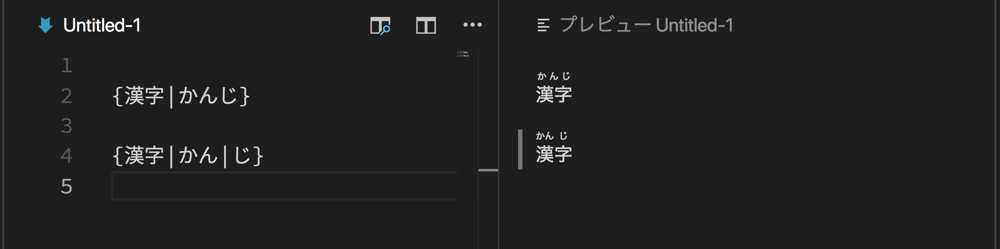

# markdown-ruby

This is the VS Code extention that adds {ruby|ルビ} syntax support to built-in markdown preview.  
This extension is built on [markdown-it-ruby](https://github.com/lostandfound/markdown-it-ruby).

## Features

- `{漢字|かんじ}` => `<ruby>漢字<rt>かんじ</rt></ruby>`
- `{漢字|かん|じ}` => `<ruby>漢<rt>かん</rt>字<rt>じ</rt></ruby>`

